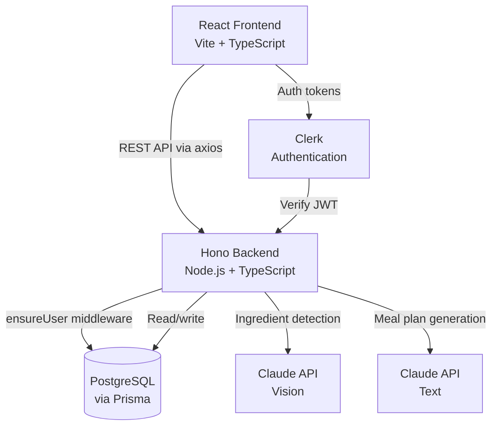

# 🥘 AI Pantry Chef

> Upload a photo of your fridge or pantry and get a personalized, AI-generated weekly meal plan — complete with recipes, ingredients, and a shopping list for what you're missing.

**🌐 Live Demo: [ai-pantry-chef-mu.vercel.app](https://ai-pantry-chef-mu.vercel.app)**

<!-- demo GIF -->


---

## ✨ What It Does

AI Pantry Chef eliminates the daily "what should I make for dinner?" problem by turning a photo of your fridge into a complete 7-day meal plan in seconds.

1. **📸 Upload a photo** of your fridge or pantry
2. **🤖 Claude's vision AI detects** your ingredients automatically
3. **✏️ Review and edit** the ingredient list before generating
4. **🍽️ Get a personalized 7-day meal plan** with breakfast, lunch, and dinner — including full recipes and measurements
5. **🛒 See a shopping list** of ingredients you'd need to buy
6. **💾 Save your plan** and access it anytime from your history

---

## 🛠 Tech Stack

| Layer | Technology | Why |
|---|---|---|
| Frontend | React + TypeScript + Vite | Industry-standard UI stack with type safety |
| Backend | Node.js + TypeScript + Hono | Modern, lightweight REST API framework |
| Database | PostgreSQL + Prisma | Type-safe ORM with relational data integrity |
| AI | Claude API (vision + text) | Vision for photo analysis, text for meal plan generation |
| Auth | Clerk | Production-grade auth with per-user data isolation |
| Deployment | Vercel + Railway | Frontend on Vercel, backend + DB on Railway |

---

## 🏗 Architecture



**Key design decisions:**
- **AI generation and persistence are intentionally separate** — the backend generates a meal plan without saving it, allowing users to review and approve before it's stored. This enables a cleaner V2 editing flow.
- **Structured prompt engineering** — Claude returns strict JSON schemas for both ingredient detection and meal plan generation, making frontend rendering deterministic.
- **Layered error handling** — image type/size validation on the frontend, media type and size enforcement on the backend, and graceful fallbacks for empty or unrecognizable images.
- **Auth bridging via middleware** — Clerk handles authentication; an `ensureUser` middleware automatically creates a database user record on first login, linking Clerk's user ID to an internal PostgreSQL record.

**Key design decisions:**
- **AI generation and persistence are intentionally separate** — the backend generates a meal plan without saving it, allowing users to review and approve before it's stored. This enables a cleaner V2 editing flow.
- **Structured prompt engineering** — Claude returns strict JSON schemas for both ingredient detection and meal plan generation, making frontend rendering deterministic.
- **Layered error handling** — image type/size validation on the frontend, media type and size enforcement on the backend, and graceful fallbacks for empty or unrecognizable images.
- **Auth bridging via middleware** — Clerk handles authentication; an `ensureUser` middleware automatically creates a database user record on first login, linking Clerk's user ID to an internal PostgreSQL record.

---

## 🚀 Features

- [x] Photo upload with file type and size validation
- [x] AI-powered ingredient detection via Claude vision API
- [x] Editable ingredient list (add, remove, duplicate prevention)
- [x] 7-day meal plan generation with full recipes and measurements
- [x] Missing ingredient / shopping list generation
- [x] Save meal plans to database
- [x] View saved meal plan history
- [x] User authentication via Clerk
- [x] Per-user data isolation
- [x] Deployed to Vercel + Railway

---

## 🗺 Roadmap

### V2 — Personalization & Editing
- **Multiple photo uploads** — combine fridge + pantry + multiple shelves into one ingredient list
- **Meal plan options** — set grocery budget, dietary preferences, serving size, and which days/meals to include before generating
- **Pantry staples** — save always-available ingredients (salt, butter, oil) so they're automatically included in every plan
- **Smart staples detection** — when Claude detects common staples in a photo, prompt the user to save them for future plans
- **Meal swapping** — regenerate individual meals without rebuilding the whole plan
- **Manual ingredient entry** — add ingredients without a photo

### V3 — Intelligence & Social
- **Recipe ratings** — rate individual recipes to personalize future meal plans
- **Personal recipe library** — save favorite meals and pin them to future plans
- **Streaming generation** — see the meal plan appear in real time instead of waiting
- **Background job processing** — generate plans asynchronously so users can navigate away and return
- **Grocery list export** — export your shopping list to a shareable format
- **Nutrition info** — add nutritional data per meal

---

## 🏃 Running Locally

### Prerequisites
- Node.js 18+
- PostgreSQL
- Anthropic API key (get one at [console.anthropic.com](https://console.anthropic.com))
- Clerk account (get one at [clerk.com](https://clerk.com))

### Setup

```bash
# Clone the repo
git clone https://github.com/mollyberg/ai-pantry-chef.git
cd ai-pantry-chef

# Install frontend dependencies
cd frontend && npm install && cd ..

# Install backend dependencies
cd backend && npm install && cd ..
```

### Environment Variables

Create `backend/.env`:
```
DATABASE_URL="postgresql://YOUR_USERNAME@localhost:5432/ai_pantry_chef?schema=public"
ANTHROPIC_API_KEY="your-anthropic-api-key"
CLERK_SECRET_KEY="your-clerk-secret-key"
CLERK_PUBLISHABLE_KEY="your-clerk-publishable-key"
```

Create `frontend/.env`:
```
VITE_API_URL=http://localhost:3001
VITE_CLERK_PUBLISHABLE_KEY="your-clerk-publishable-key"
```

### Database Setup

```bash
cd backend
npx prisma generate
npx prisma migrate dev
```

### Run the App

```bash
# Terminal 1 — backend
cd backend && npm run dev

# Terminal 2 — frontend
cd frontend && npm run dev
```

Frontend: `http://localhost:5173`
Backend: `http://localhost:3001`

---

## 📁 Project Structure

```
ai-pantry-chef/
├── frontend/
│   ├── src/
│   │   ├── api/          # Axios instance + all API calls
│   │   ├── components/   # Reusable UI components
│   │   ├── pages/        # Page-level components
│   │   └── types/        # Shared TypeScript types
│   └── ...
├── backend/
│   ├── src/
│   │   ├── controllers/  # Business logic
│   │   ├── routes/       # API route definitions
│   │   ├── lib/          # Shared instances (Prisma, Anthropic)
│   │   └── middleware/   # Clerk auth + ensureUser
│   ├── prisma/
│   │   └── schema.prisma # Database schema
│   └── ...
└── README.md
```

---

## 👩‍💻 Built By

**Molly Berg** — Full-stack engineer with a background in AI tooling, developer experience, and technical education.

- 🔗 [LinkedIn](https://linkedin.com/in/mollykberg)
- 🐙 [GitHub](https://github.com/mollyberg)
